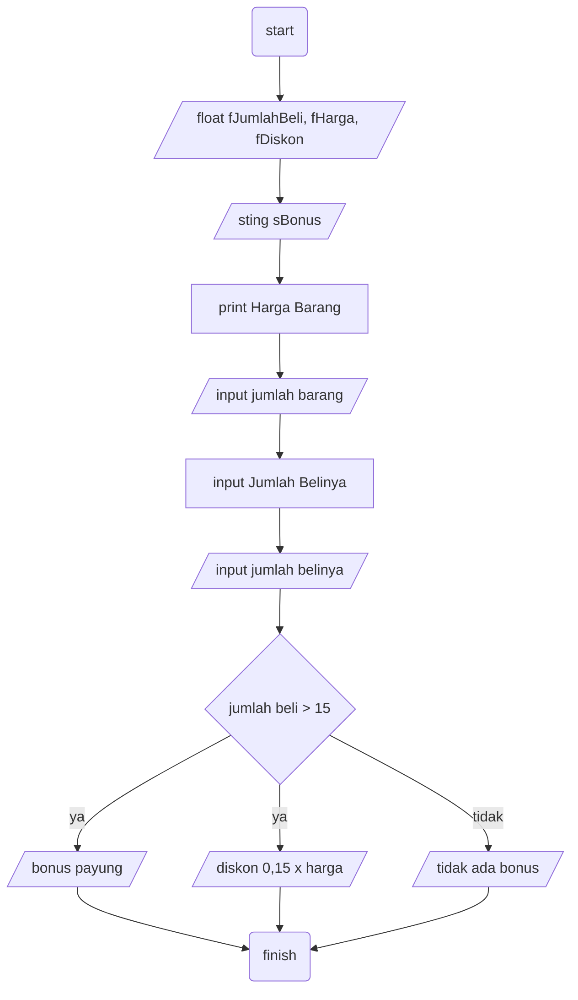

```mermaid
    flowchart TD;

A(start) --> B[/float fJumlahBeli, fHarga, fDiskon/];
B --> C[/sting sBonus/];
C --> D[print Harga Barang];
D --> E[/input jumlah barang/];
E --> F[input Jumlah Belinya];
F --> G[/input jumlah belinya/];
G --> H{jumlah beli > 15};
H --ya--> I[/bonus payung/];
H --ya--> J[/diskon 0,15 x harga/];
H --tidak--> K[/tidak ada bonus/];
I --> O(finish)
J --> O
K --> O
```